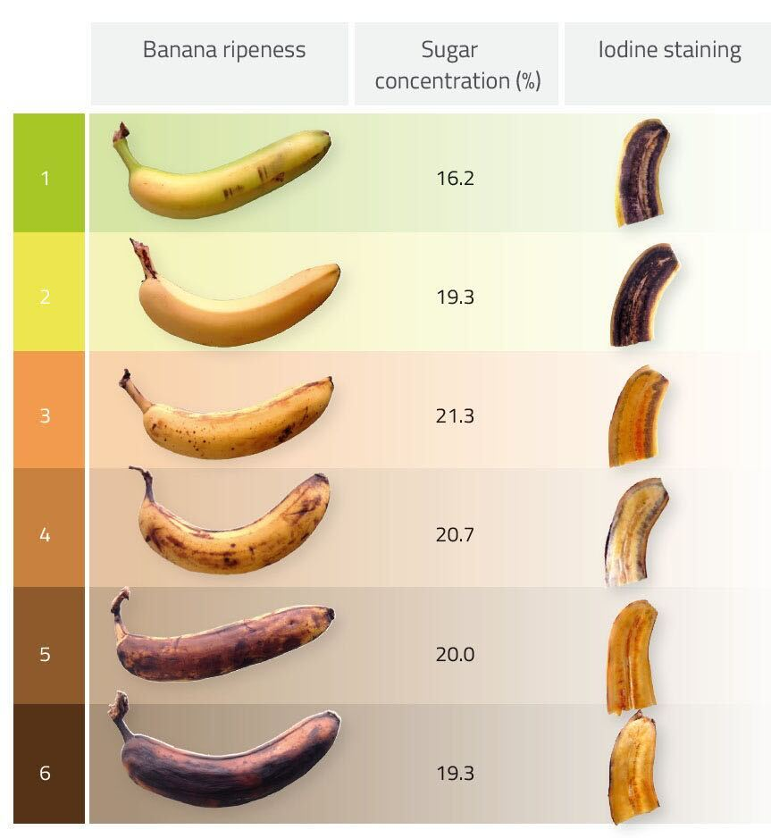

## Pre-Experimental Plan: Evaluating the Impact of Simple Tricks on Fruit Ripening

### Objective
The aim of this experiment is to investigate whether simple, cost-effective techniques can influence the ripening process of fruit. The study will be conducted under a budget constraint of $7.

### Choice of Fruit
To ensure ease of ripeness assessment and remain within our financial limits, we have selected bananas as the fruit of choice.

### Treatments
We will investigate two types of treatments:
1. **Poking Holes:** Creating 20 needle-sized perforations in each banana.
2. **Submerging in Liquids:** Briefly submerging each banana for 10 seconds in one of the following liquids:
   - Diet Coke
   - Milk

These treatments result in six distinct conditions:
|                     | **No Liquid**       | **Diet Coke (DC)** | **Milk (M)**  |
|---------------------|---------------------|--------------------|---------------|
| **No Poking**       | Control             | DC                 | M             |
| **Poking Holes (H)**| H                   | H + DC             | H + M         |

### Experimental Design
- **Sample Size:** A total of 30 bananas will be used.
- **Replicates:** We will select 5 bunches, each containing 6 bananas, and randomly assign one banana from each bunch to each treatment condition. This design ensures 5 replicates per treatment and helps control for genetic variability among the bananas.
- **Environment:** The experiment will be conducted in a climate-controlled bedroom with no windows, ensuring that the bananas are shielded from sunlight and eliminating UV light as a potential confounding factor.
- **Setup:** On each of 5 separate shelves, 6 bananas from a single bunch will be arranged in a row. The position of each treated banana on the shelf will be randomized to minimize positional effects.
- **Duration:** The experiment will run for 3 days—a time frame deemed appropriate for observing ripening changes while maintaining practical relevance.
- **Budget:** All necessary materials, including bananas, a needle, Diet Coke, and milk, will be procured within the $7 budget.

The experiment will thus have the following sample sizes for each treatment:
|                     | **No Liquid** | **Diet Coke (DC)** | **Milk (M)** | **Total** |
|---------------------|----------------|-------------------|--------------|-----------|
| **No Poking**       | 5              | 5                 | 5            | 15        |
| **Poking Holes (H)**| 5              | 5                 | 5            | 15        |
| **Total**           | 10             | 10                | 10           | 30        |

### Evaluation
To ensure objectivity and reduce bias, we will conduct a blind assessment of ripeness using two methods:
1. **Color Scale:** Rating each banana on a scale from 1 (greenest) to 6 (darkest).
2. **Taste Test:** Blindly rating the flavor of each banana on a scale from 1 (least ripe) to 5 (most ripe).

Here is the color scale we will use:

We will have 3 blind taste testers.

### Data Covariates
For each banana, we will record the following attributes:
 - ID: identifier
 - row (shelf number)
 - column (position within shelf)
 - hole treatment: H, NH
 - liquid treatment: NL, DC, M
 - color: 1 to 6 (from colorscale above)
 - taste_j: taste 1 through 5 from taster j

### Analysis
After the experiment, we will analyze the collected data to determine the impact of each treatment on the ripening process. Specifically, we will examine both marginal effects—isolating the impact of each individual treatment (poking holes or submerging in liquid)—and joint effects, which consider the combined influence of multiple treatments. This approach will help us understand how different treatment combinations interact to affect the ripening process.
