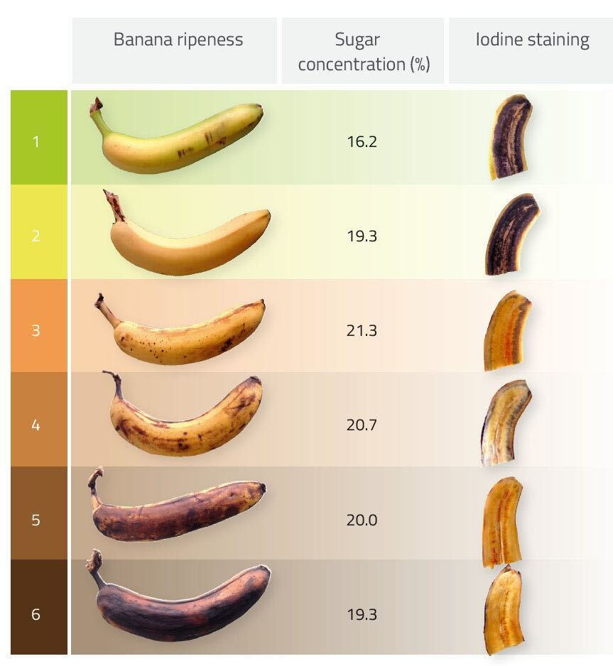

```{r setup, include=FALSE}
knitr::opts_chunk$set(echo = TRUE)
plot_folder = "../output/plots/"
```


# Introduction

Accelerating fruit ripening through household methods is a common practice, yet the scientific basis of many such techniques remains underexplored. This study investigates the effectiveness of two straightforward interventions—poking holes in fruit and dipping it in different liquids—as potential methods to influence ripening rates. These methods were selected to assess whether minor physical modifications or exposure to common liquids can meaningfully alter the ripening process.

We selected bananas as our experimental fruit due to their affordability, accessibility, and well-documented ripening stages, making them ideal for observing treatment-induced changes. For the liquid treatments, we prioritized readily available, low-cost options to maximize the practical relevance of our findings. Diet Coke and milk were chosen to provide contrasting chemical profiles: Diet Coke, an acidic, highly-sweetened solution, and milk, a protein-rich, fatty liquid. This contrast allows us to examine how these common household liquids might differently impact ripening dynamics.

By systematically evaluating these interventions in a controlled setting, this experiment aims to push the boundaries of everyday techniques for fruit ripening. We hope to provide evidence-based insights into the potential of simple, accessible modifications to modulate ripening, with implications for both household practices and the broader scientific understanding of fruit ripening processes.

# Research Questions

Our study is guided by the following research questions to explore the effects of physical modification and liquid exposure on banana ripening:

1. **Effect of Poking Holes**: Does poking holes in bananas affect their ripening rate compared to bananas with no holes?

2. **Effect of Diet Coke Dipping**: Does dipping bananas in Diet Coke influence their ripening pace compared to bananas left dry?

3. **Effect of Milk Dipping**: Does dipping bananas in milk alter their ripening process differently than bananas left dry?

Through these questions, we aim to determine whether simple physical and chemical treatments can significantly impact the ripening dynamics of bananas.


# Experimental Design

To examine the effects of physical and chemical treatments on banana ripening, we employed two types of interventions: poking holes ($T_H$) and dipping bananas in liquids ($T_L$). Each banana was modified by applying 10 needle-sized holes per side and dipped in one of two liquids for 10 seconds.

For the hole treatment, $T_H$, we defined two levels: NH (no holes) and H (holes). Therefore,
$$
T_H = \text{NH} \cdot 1_{\text{no holes poked}} + \text{H} \cdot 1_{\text{holes poked}}.
$$

For the liquid treatment, $T_L$, we selected three levels: NL (no liquid), DC (Diet Coke), and M (milk). Thus,
$$
T_L = \text{NL} \cdot 1_{\text{not dipped in liquid}} + \text{DC} \cdot 1_{\text{dipped in Diet Coke}} + \text{M} \cdot 1_{\text{dipped in milk}}.
$$

To maximize sample size and allow for the analysis of potential interaction effects, each banana was subjected to both treatments in sequence: the hole treatment ($T_H$) was applied first, followed by the liquid treatment ($T_L$). This order was chosen based on the hypothesis that creating holes may enhance the impact of the liquid treatment by allowing the liquid to penetrate the fruit’s flesh rather than simply coating the skin.

## Randomization and Blocking Scheme

With a budget of \$7, and taking into account local grocery prices in Ann Arbor, we were able to acquire 30 bananas. Given our 6 ($2 \times 3$) treatment combinations, this allowed us to conduct the experiment with 5 replicates per combined treatment condition. To minimize confounding factors such as genetic variation, initial ripeness, and sourcing origin, each replicate was selected from the same bunch of bananas, yielding 5 bunches of 6 bananas each and ensuring consistency across treatment conditions.

Our experimental design thus yielded the following distribution across treatment conditions:

|                | **NL** | **DC** | **M** | **Total** |
|----------------|--------|--------|-------|-----------|
| **H**         | 5      | 5      | 5     | 15        |
| **NH**        | 5      | 5      | 5     | 15        |
| **Total**     | 10     | 10     | 10    | 30        |

The experiment was conducted in a windowless, climate-controlled room to eliminate confounders such as UV exposure. Each bunch was placed on a separate shelf of a vertical shelving unit to control for potential temperature gradients in the air column (with warmer air generally near the ceiling). Treatment assignments were randomized using the script `./data/randomization.R`, resulting in the following spatial arrangement:

```{r, echo=FALSE, fig.align='center', out.width='60%', fig.cap="Spatial layout of treatment assignment for bananas."}
knitr::include_graphics(file.path(plot_folder, "treatment_assignment.png"))
```

Following treatment, the bananas were placed on paper towel-lined shelves to absorb any residual liquid and were left undisturbed for a period of 3 days, allowing for consistent observation of ripening changes across all treatment groups.

## Evaluating Outcomes
While ripeness in bananas can be assessed via chemical tests or the use of pre-trained black-box models, we aimed to design outcomes that (1) did not use outside data and (2) fit in our budget constraints. Furthermore, domain stakeholders (i.e. people who eat bananas) typically care about ripeness only in-so-far as it affects the taste of bananas. To that end, we chose a largely subjective taste assessment and a somewhat more objective color assessment which we will explain in detail in the following sections.

### Taste

To evaluate taste, three of us tasted all 30 bananas and rated them on a ripeness scale from zero to five in increments of one half. Our fourth group member who did not taste the bananas administered the bananas to us in a random order. After drawing a random order of bananas to taste, the tasters sat in an orientation such that they could not see the bananas, while our fourth member cut the bananas into small, bite-sized pieces and brought them to us on a plate. This setup can be considered a single-blinded as the tasters were unaware of which banana we were tasting, while our fourth group member was aware. However, there was minimal interaction from our fourth group member such that we don't expect our results to be different than had we used an intermediary unaware of the different treatment conditions.  

After collecting three ratings for each of the thirty bananas, for each banana we averaged the three scores to come up with a final taste outcome $O_t \in [0, 5]$ for each banana. 

### Color

<center>


</center>

<center>


</center>

To evaluate color, we took a picture of each banana prior to tasting. The pictures were taken in the exact same setting within five minutes of one another with identical light conditions and banana orientation. After getting a picture of each banana, we used Photoshop to remove the background and the black part of each stem. We removed stems because different bananas had significantly different amounts of black toward the end of the stem simply as a result of how the bananas were separated from their bunch. Furthermore, the holes that we poked in the bananas left small but noticeable black dots surrounding the puncture point. These darkened parts were removed using the clone stamp tool in Photoshop by filling them in with the surrounding color of the banana. The holes were removed because while they did change the color of the banana at the puncture points, they did not seem to be of biological nor culinary interest. The photo-editing process is pictured above.

<center>



</center>

After transparent images of each banana were created, we used the `magick` package in `R` to calculate the average (R,G,B) value of each photo. From here, we used a reference image that detailed the different stages of ripeness, pictured above. We took the 6 reference values as points $p_1, p_2, \dots, p_6 \in \mathbb{R}^3$. Then, we considered the line segments $l_1, l_2, ..., l_5$ where $l_i$ starts at $p_i$ and ends at $p_{i+1}$. Let us call the union of these line segments $L = \bigcup_{i=1}^5 l_i$. Then, we projected each banana point $\{b_i\}_{i=1}^{30}$ in (R,G,B) space onto $L$. For all projected points $\{P_L(b_i)\}_{i=1}^{30}$ we calculated how far along $L$ the point was with $P_L(b_i) = p_1$ corresponding to 0 and $P_L(b_i) = p_6$ corresponding to 1. As such, our color outcome $O_c \in [0,1]$ for each banana.

# Data Analysis

The files to run all the analysis are inside of the $\texttt{./analysis/}$ folder.

## Data Format

In this section, we display the format of data from the designed experiment. 

The dataset has 30 rows and 10 columns, with each row containing the information on an individual sample of banana. The features and their descriptions are as follows:

- **ID**: An identifier for each banana sample.
- **row** and **column**: Indicators of the sample’s spatial position in the experiment. **row** indicates the number of shelf that the sample is on and **column** indicates the location within shelf.
- **treatment_idx**: An index representing the specific treatment combination applied to each sample. 
- **hole_treatment**: A categorical variable with two levels (`H`, `NH`), indicating whether the banana sample underwent a "hole" treatment. For example, `H` denotes that the hole treatment was applied to the sample.
- **liquid_treatment**: Another categorical variable with three levels, representing the type of liquid treatment applied to the sample. **NL** denotes that no liquid treatment was applied, **DC** denotes that diet coke was applied to the sample and **M** denotes that milk was applied.
- **color**: A numerical value representing the color score of the banana. This value is obtained by the method described in the evaluation section.
- **taste_1**, **taste_2**, and **taste_3**: Subjective taste scores for the banana sample, recorded across three different tasters. 

In our study, we use **color** and the average taste score as the assessment for banana ripeness. The average taste score is the mean of **taste_1**, **taste_2**, and **taste_3** values.
 

## Exploratory Data Analysis

To explore the initial patterns in our data, we conducted an Exploratory Data Analysis using heatmaps and distribution plots to assess the spatial patterns and the effects of treatment on color and taste, which are the indicators of banana ripeness.

We began by examining whether the position of bananas on shelves affeced the taste and color. Heatmaps of taste and color ratings by row and columns were created to visualize the potential spatial effects (Figure \ref{fig:heatmaps_pos}). From the heatmaps, no discernible patterns were observed, which indicates that the spatial location of samples did not have a significant impact on the ripening process in terms of taste and color. This allowed us to proceed to further analysis without needing to account for spatial location as a confounding factor.

```{r heatmaps_pos, echo=FALSE, fig.align='center', out.width='100%', fig.cap="Heatmap of Color and Taste Ratings by Row and Column."}
knitr::include_graphics(file.path(plot_folder, "heatmaps_pos.png"))
```

Next, we focused on the effects of the hole treatment on average taste and color (Figure \ref{fig:combined_dist_hole}). The distribution plot of average taste showed that bananas with holes tended to have slightly higher ratings compared to those without holes. This suggests that the hole treatment may have accelerated the ripening process, potentially enhancing the flavor or texture, resulting in higher scores. Similar trend appeared in the distribution plot of color. Bananas with holes turned darker more quickly, indicating a faster ripening. This finding further supports the idea that the hole treatment can influence banana ripening process.

```{r combined_dist_hole, echo=FALSE, fig.align='center', out.width='100%', fig.cap="Distribution Plots across Hole Treatment."}
knitr::include_graphics(file.path(plot_folder, "combined_dist_hole.png"))
```

We also analyzed the effect of liquid treatments on taste and color by examining the distribution plots across different treatments (Figure \ref{fig:combined_dist_liquid}). The results related to showed minimal variation in both color and taste ratings among the liquid treatments, suggesting that the type of liquid did not significantly impact the taste of the bananas. 

```{r combined_dist_liquid, echo=FALSE, fig.align='center', out.width='100%', fig.cap="Distribution Plots across Liquid Treatments."}
knitr::include_graphics(file.path(plot_folder, "combined_dist_liquid.png"))
```

Building on these initial observations from the exploratory data analysis, we proceeded with statistical testing to rigorously evaluate the effects of each treatment on banana ripeness, focusing specifically on their impact on color and taste. 


## Planned Tests and Reported p-values

To assess the impact of the hole treatment and liquid treatments on fruit ripeness, several permutation-based tests was employed for the data analysis. 

**Blocked Permutation Test**: The blocked permutation test was conducted to control the potential confounders related to the bunches of bananas. In the test, we use the differences in average assessment metrics (color or taste) between each single treatment group and control group. By permuting within blocks, we ensured that any differences observe could be attributed more confidently to the treatment effect rather than the differences between bunches. 

**Blocked ANOVA for Liquid Treatment**: We also used an ANOVA blocked permutation test to assess the overall differences between multiple treatment groups, specifically for evaluating the liquid treatments. Since we have two different types of liquid treatments, this method allowed us to test for significant differences across the three levels (control, diet coke and milk) related to banana ripeness. Same as the blocked permutation test, we incorporated blocking by bunch to account for the variability among different banana bunches to ensure that the observed effect is not confounded by the differences between bunches.

**Permutation ANOVA with Interaction**: Permutation ANOVA with interaction was also conducted to explore whether the hole treatment interacts with the liquid treatments in influencing banana ripeness. This analysis aims to identify any effects between the hole and liquid treatments, which could reveal complex interactions that affect ripeness beyond the main effects of each single treatment. By permuting the data to test for interaction terms, this approach offers a flexible way to explore whether the combination of treatments produces an impact on ripeness that differs from the effects of each treatment independently.


The following part displays the result from the permutation tests.

### Color Assessment

The following table displays the results for color assessment for banana ripeness. 

| Test                  | Treatment    | p-value |
|-----------------------|-------------|---------|
| Blocked Permutation   | Hole        | **0.015** |
| Blocked Permutation   | Diet Coke   | 0.101   |
| Blocked Permutation   | Milk        | 0.169   |
| Blocked ANOVA         | All Liquid  | 0.585   |
| ANOVA with Interaction| Hole & Liquid | **0.040** |

The color assessment for banana ripeness showed notable effects of some treatments. The blocked permutation test for the hole treatment revealed a significant difference in color between bananas with and without holes, with a p-value of 0.015. This indicates that the hole treatment alone altering the ripening process.

For the Diet Coke and Milk treatments, the blocked permutation tests did not show a significant impact on color, with p-values of 0.101 and 0.169, respectively. This suggests that these liquid treatments individually do not strongly influence banana ripeness in terms of color. Moreover, the blocked ANOVA for the liquid treatments yielded a p-value of 0.585, which confirmed that, as a group, the liquid treatments did not significantly impact color.

However, the ANOVA with interaction analysis showed a significant interaction effect between the hole and liquid treatments, with a p-value of 0.040. This result suggests that the combination of hole and liquid treatments may affect ripening in a way that neither treatment does alone.
In summary, the hole treatment alone significantly affects banana color, and there may be an interaction effect when combined with liquid treatments.


### Taste Assessment

In the taste assessment, we observed that neither the hole treatment nor the liquid treatments had a statistically significant effect on the ripeness pace as measured by taste. 

The blocked permutation test for the hole treatment yielded a p-value of 0.375, indicating no significant difference in taste between bananas with and without holes. Similarly, the blocked permutation tests for the liquid treatments (Diet Coke and Milk) produced p-values of 0.303 and 0.126, respectively, suggesting that these treatments did not significantly impact taste.

The lack of significance from the blocked ANOVA further supports the conclusion that, collectively, the liquid treatments do not influence banana taste in terms of ripeness, with a p-value equals to 0.585.

Finally, the ANOVA with interaction test, used to examine potential interactions between the hole and liquid treatments, returned a p-value of 0.346. This indicates that there was no significant interaction effect between the two types of treatments on taste.


| Test                  | Treatment    | p-value |
|-----------------------|-------------|---------|
| Blocked Permutation   | Hole        | 0.375   |
| Blocked Permutation   | Diet Coke   | 0.303   |
| Blocked Permutation   | Milk        | 0.126   |
| Blocked ANOVA         | All Liquid  | 0.585   |
| ANOVA with Interaction| Hole & Liquid | 0.346   |


# Conclusion

Our findings from permutation tests indicate that the impact of treatments on banana ripening varies depending on the metric used to assess ripeness. When using color as the measure, poking holes in bananas significantly alters the ripening process. In contrast, the liquid treatments, whether Diet Coke or milk, did not significantly affect the ripening pace based on color. Additionally, there was a significant interaction between the hole and liquid treatments, indicating a complex relationship that influenced color in a way that neither treatment alone achieved.

However, when assessing ripeness through taste, neither poking holes nor dipping bananas in Diet Coke or milk had a significant effect on the ripening pace. Furthermore, no significant interaction effect was observed between these two treatments with respect to taste.

In summary, our study demonstrates that poking holes in bananas can influence the ripening process to some extent, while the liquid treatments we tested did not have a notable effect. The interaction between hole and liquid treatments showed a more complex impact on color but not on taste, highlighting how different metrics may reveal different aspects of the ripening process.